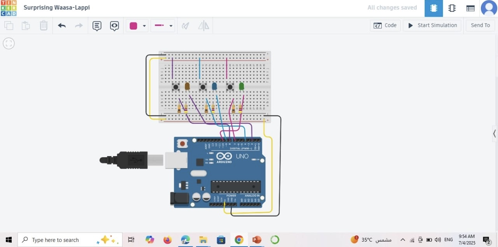

# 🔘 Button LED Control System – Task 1

## 📌 Project Overview
This project implements a basic control system using an Arduino Uno board.  
Three push buttons are used to control three LEDs (orange, blue, and green).  
Each button is mapped to a specific LED: when the button is pressed, the corresponding LED turns ON.

This task aims to demonstrate fundamental embedded systems concepts: inputs, processing, and outputs.

---

## 🧰 Components Used

| Component        | Quantity | Notes                                |
|------------------|----------|---------------------------------------|
| Arduino Uno      | 1        | Main microcontroller board            |
| Push buttons     | 3        | One per LED                           |
| LEDs             | 3        | Orange, Blue, Green                   |
| Resistors        | 6        | 3 for LEDs, 3 for push buttons        |
| Breadboard       | 1        | For circuit assembly                  |
| Jumper wires     | Several  | For making the electrical connections |

---

## 🔌 Circuit Overview

- Each push button is connected to a digital input pin.
- Each LED is connected to a digital output pin via a resistor.
- The system follows the model: Input → Processing → Output.

📷 Visual references and circuit diagrams are available in the images section of this repository.

---

## 🧾 Pin Mapping

| Push Button | Arduino Pin | LED Color | LED Pin |
|-------------|-------------|-----------|---------|
| Button 1    | D2          | Orange    | D8      |
| Button 2    | D4          | Blue      | D9      |
| Button 3    | D7          | Green     | D10     |

---

## 💡 Arduino Code

The complete Arduino code for this task is included in the file:  
button_led_control.ino (uploaded in the repository)

It includes:
- Pin declarations  
- Digital input/output setup  
- Looping logic to check button state and control corresponding LED

---

## 📸 Images Included

- Full circuit layout  
- Individual views showing each button-to-LED connection  
- Arduino IDE screenshots showing the full working code

---

## ✅ Status

- [x] Circuit implemented successfully  
- [x] Code tested and verified  
- [x] Documentation completed  

---

## ✨ Created by:  
Ryoof Al-Malki
